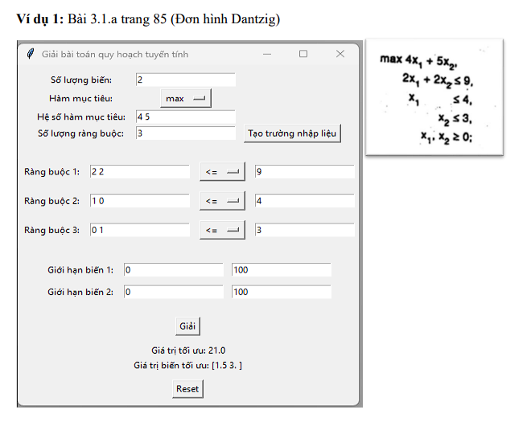
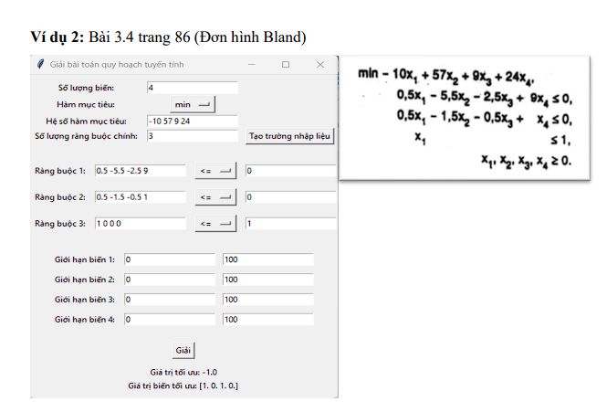
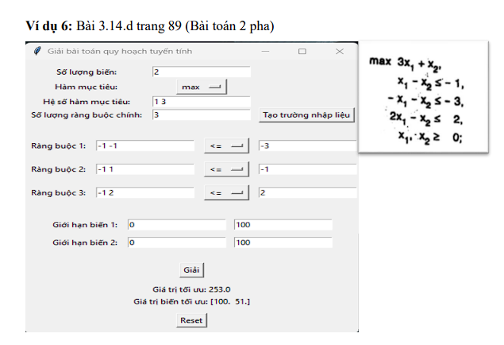

# Linear-Programming-Problem-Solver
Project Linear Programming VNU-HCMUS 2022-2023

## Introduction
A linear programming problem is a type of optimization problem in which the goal is to find the optimal value of a linear objective function within a set of linear constraints.
An application designed to solve linear programming problems using multiple methods. The interface is built using the Tkinter framework. The program allows users to enter information about the number of variables, objective functions, constraints and limits of variables. Using the `scipy.optimize` library to solve the linear programming problem and display the optimal results.

## Demo

